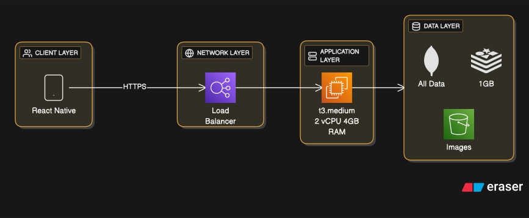
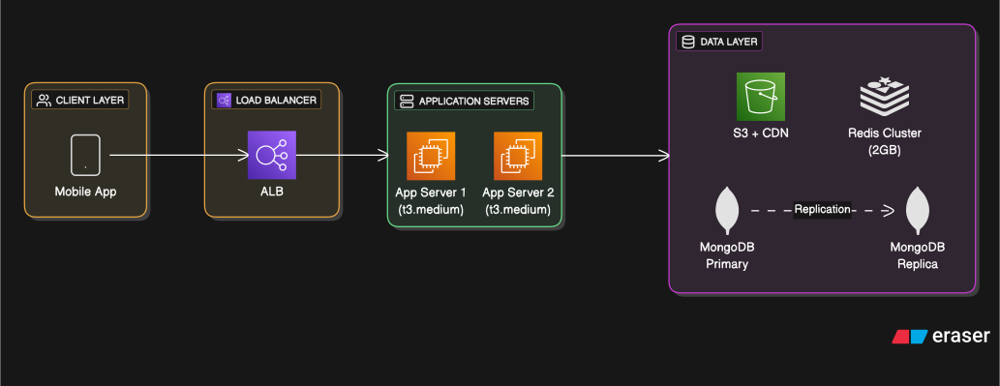
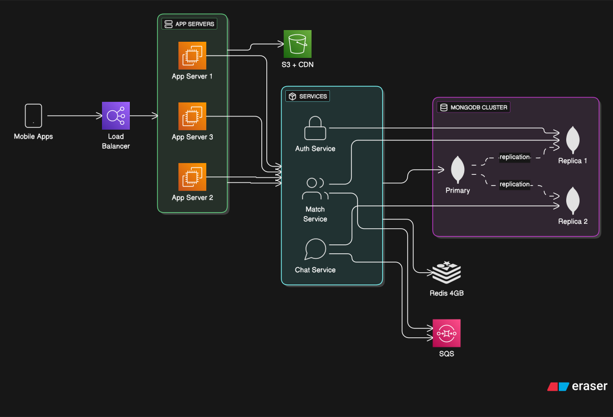

# Technical Architecture

## Technology Stack

### Frontend
- **Framework**: React Native
- **State Management**:  Zustand
- **Navigation**: React Navigation
- **UI Library**: React Native Paper or Native Base
- **Image Handling**: react-native-fast-image
- **Maps**: React Native Maps
- **HTTP Client**: Axios
- **WebSocket**: Socket.io-client

### Backend
- **Runtime**: Node.js 22+
- **Framework**: Express.js
- **API Style**: RESTful + WebSocket
- **Authentication**: JWT tokens + bcrypt
- **Real-time**: Socket.io for chat
- **Validation**: express-validator

### Database
- **Primary DB**: MongoDB 7+
  - Collections: users, profiles, matches, messages, swipes
  - Geospatial queries for location-based matching
  - Replica set for high availability
- **Cache**: Redis 7
  - Session storage
  - Active user cache
  - Match queue
  - Rate limiting

### Storage
- **Images**: AWS S3 or Cloudinary
- **CDN**: CloudFront for fast image delivery

### Infrastructure
- **Hosting**: AWS EC2
- **Container**: Docker (optional for dev)
- **Load Balancer**: AWS ALB or Nginx
- **Version Control**: Git + GitHub

### Third-Party Services
- **SMS**: Twilio or Firebase Auth
- **Push Notifications**: Firebase Cloud Messaging (FCM)
- **Monitoring**: Basic logging (Winston) + Sentry
- **Analytics**: Mixpanel or Amplitude

---

## System Architecture Diagrams

### Phase 1: Single Server (0-1K Users)

### Phase 2: Horizontal Scaling (1K-5K Users)

### Phase 3: Microservices (5K-10K Users)

