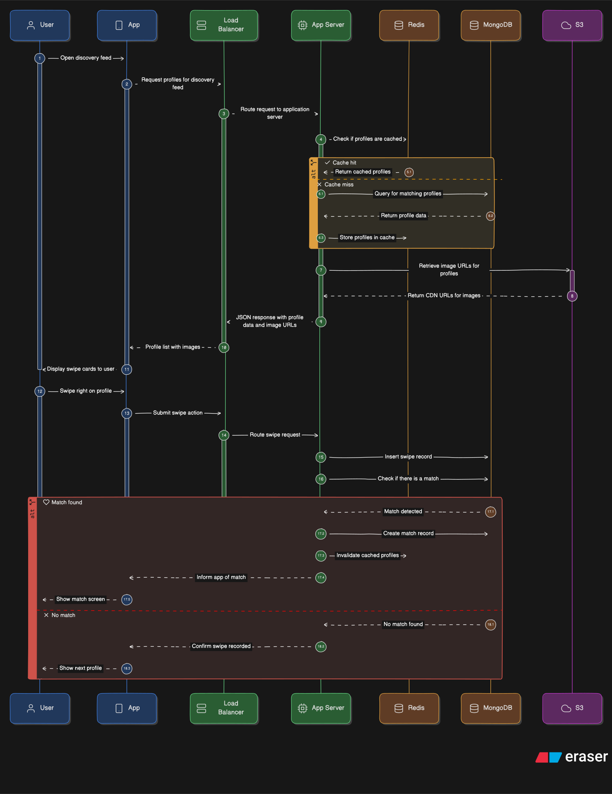
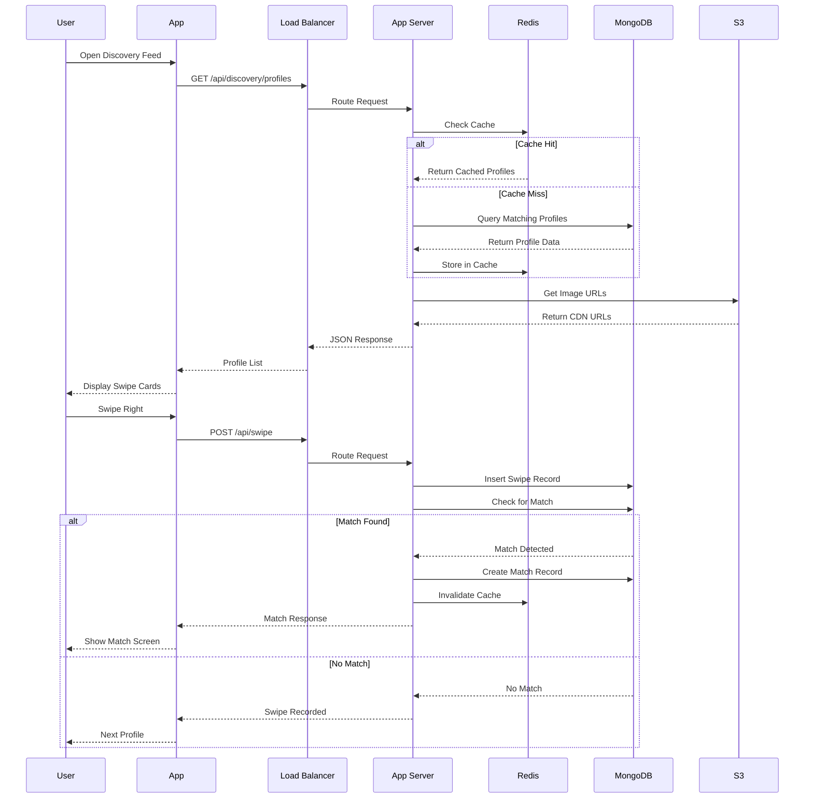

# API Endpoints

## API Request Flow


<details>
<summary>Click to view API Flow Diagram</summary>


</details>

## Core Endpoints

### Authentication
```
POST   /api/auth/register        - Register with phone/email
POST   /api/auth/verify-otp      - Verify OTP code
POST   /api/auth/login           - Login
POST   /api/auth/logout          - Logout
POST   /api/auth/refresh-token   - Refresh JWT token
```

### Profile
```
POST   /api/profile              - Create profile
GET    /api/profile/me           - Get own profile
PUT    /api/profile              - Update profile
POST   /api/profile/photos       - Upload photos
DELETE /api/profile/photos/:id   - Delete photo
PUT    /api/profile/preferences  - Update preferences
```

### Discovery
```
GET    /api/discovery/profiles   - Get profiles to swipe (with filters)
POST   /api/swipe                - Swipe action (like/pass)
```
