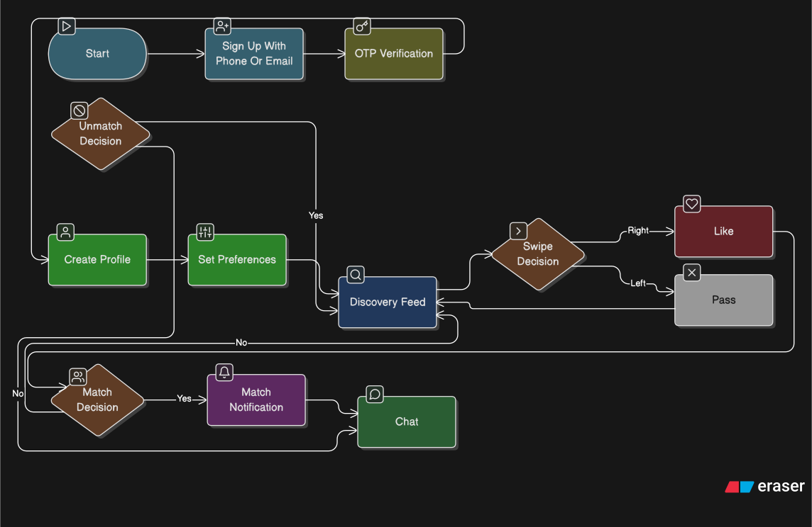
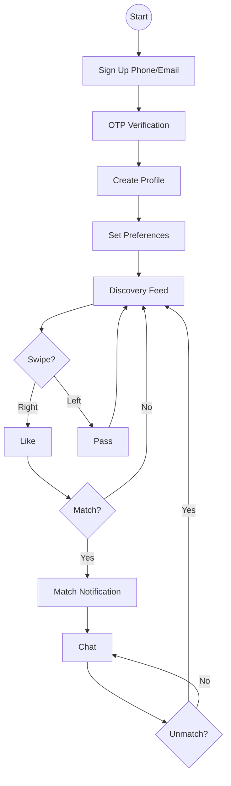

# User Flow

Click to view User Flow Diagram

## Complete User Journey

1. **Download App** → Sign up with phone/email
2. **OTP Verification** → Verify identity
3. **Create Profile** → Add photos, bio, and details
4. **Set Preferences** → Age range, distance, gender
5. **Discovery Feed** → Swipe on profiles
6. **Match** → When both users like each other
7. **Chat** → Send messages to matches
8. **Continue or Unmatch** → Keep chatting or remove match
